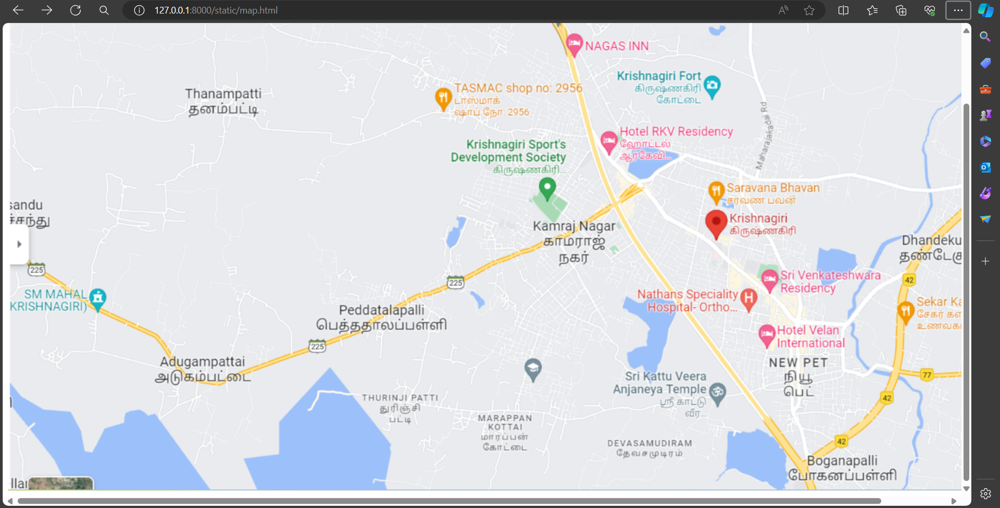
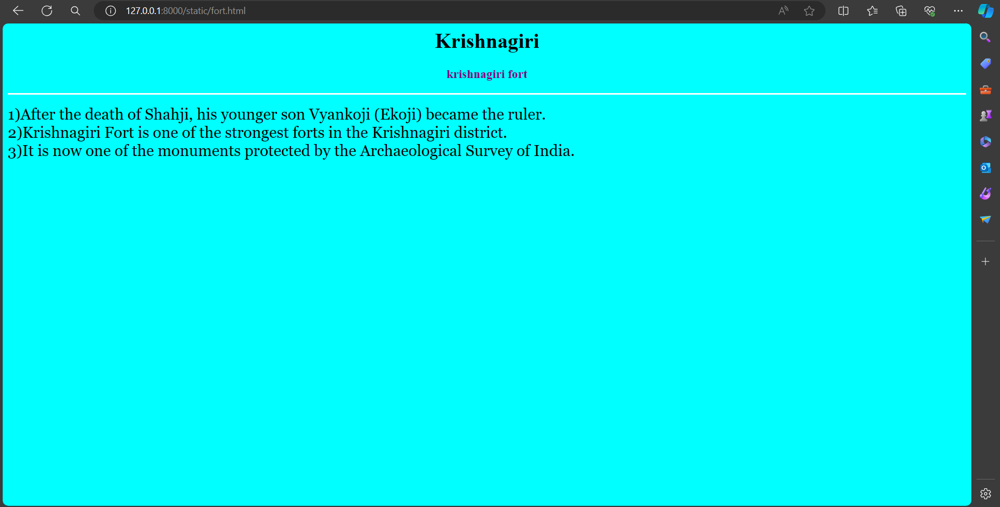
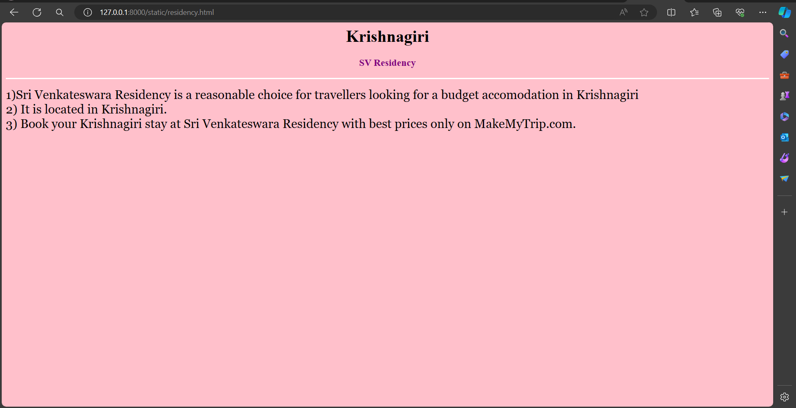
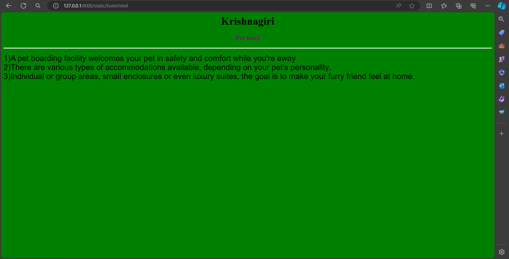
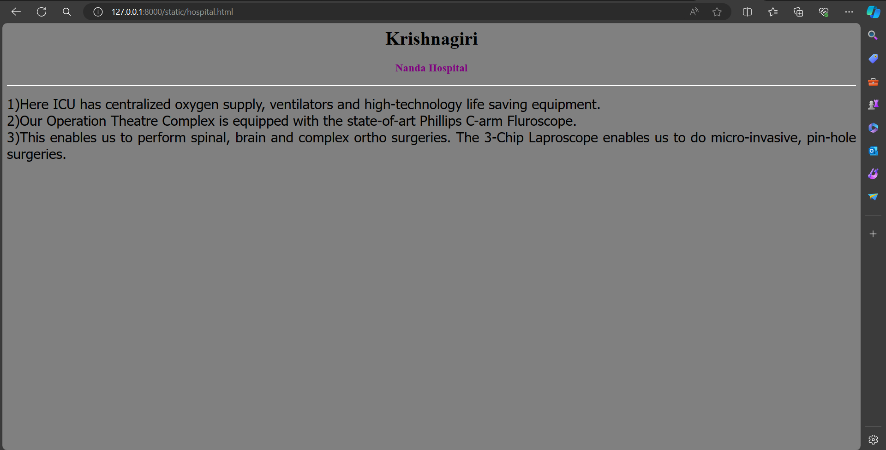
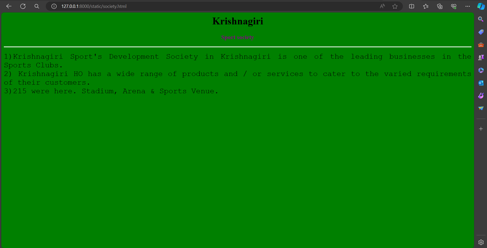

# Ex04 Places Around Me
## Date: 26.03.2024

## AIM
To develop a website to display details about the places around my house.

## DESIGN STEPS

### STEP 1
Create a Django admin interface.

### STEP 2
Download your city map from Google.

### STEP 3
Using ```<map>``` tag name the map.

### STEP 4
Create clickable regions in the image using ```<area>``` tag.

### STEP 5
Write HTML programs for all the regions identified.

### STEP 6
Execute the programs and publish them.

## CODE
~~~
map.html
<html lang="en">
<head>
<title>My City</title>
</head>
<body>
<h1 align="center">
<font color="green"><b>Krishnagiri</b></font>
</h1>
<h3 align="center">
<font color="purple"><b>Charumathi (22006878)</b></font>
</h3>
<center>

<map name="MyCity">
<area shape="rectangle" coords="881,200,1060,279" href="fort.html"  title="Krishnagiri fort">
<area shape="rectangle" coords="1104,498,1303,559" href="residency.html" title="SV residency">
<area shape="rectangle" coords="1095,583,1253,705" href="hotel.html" title=" Pet hotel">
<area shape="rectangle" coords="912,535,1106,604" href="hospital.html" title=" Nanda hospital">
<area shape="rectangle" coords="649,303,837,423" href="society.html" title="Sports society">
</map>
</center>
</body>
</html>


fort.html
<html lang="en">
    <head>
        <title></title>
    </head>
    <body bgcolor="cyan">
    <h1 align="center">
    <font color="black"><b>Krishnagiri</b></font>
    </h1>
    <h3 align="center">
    <font color="purple"><b>krishnagiri fort</b></font>
    </h3>
    <hr size="3" color="white">
    <p align="justify">
    <font face="Georgia" size="5">
    1)After the death of Shahji, his younger son Vyankoji (Ekoji) became the ruler.<br>
    2)Krishnagiri Fort is one of the strongest forts in the Krishnagiri district.<br>
    3)It is now one of the monuments protected by the Archaeological Survey of India.</font>
    </p>
    </body>
</html>


residency.html
<html lang="en">
<head>
<title> SV Residency</title>
</head>
<body bgcolor="pink">
<h1 align="center">
<font color="black"><b>Krishnagiri</b></font>
</h1>
<h3 align="center">
<font color="purple"><b>SV Residency</b></font>
</h3>
<hr size="3" color="white">
<p align="justify">
<font face="Georgia" size="5">
1)Sri Venkateswara Residency is a reasonable choice for travellers looking for a budget accomodation in Krishnagiri<br>
2) It is located in Krishnagiri.<br>
3) Book your Krishnagiri stay at Sri Venkateswara Residency with best prices only on MakeMyTrip.com.</font>
</p>
</body>
</html>


hotel.html
<html lang="en">
<head>
<title>Pet hotel</title>
</head>
<body bgcolor="green">
<h1 align="center">
<font color="black"><b>Krishnagiri</b></font>
</h1>
<h3 align="center">
<font color="purple"><b>Pet hotel</b></font>
</h3>
<hr size="3" color="white">
<p align="justify">
<font face="Arial" size="5">
   1)A pet boarding facility welcomes your pet in safety and comfort while you're away<br>
   2)There are various types of accommodations available, depending on your pet's personality.<br>
   3)Individual or group areas, small enclosures or even luxury suites, the goal is to make your furry friend feel at home.</font>
</p>
</body>
</html>


hospital.html
<html lang="en">
<head>
<title>Nanda Hospital</title>
</head>
<body bgcolor="gray">
<h1 align="center">
<font color="black"><b>Krishnagiri</b></font>
</h1>
<h3 align="center">
<font color="purple"><b>Nanda Hospital</b></font>
</h3>
<hr size="3" color="white">
<p align="justify">
<font face="Tahoma" size="5">
1)Here ICU has centralized oxygen supply, ventilators and high-technology life saving equipment.<br>
2)Our Operation Theatre Complex is equipped with the state-of-art Phillips C-arm Fluroscope. <br>
3)This enables us to perform spinal, brain and complex ortho surgeries. The 3-Chip Laproscope enables us to do micro-invasive, pin-hole surgeries.</font>
 </p>
</body>
</html>


socity.html
<html lang="en">
<head>
<title>Sport society</title>
</head>
<body bgcolor="green">
<h1 align="center">
<font color="black"><b>Krishnagiri</b></font>
</h1>
<h3 align="center">
<font color="purple"><b>Sport society</b></font>
</h3>
<hr size="3" color="white">
<p align="justify">
<font face="Courier New" size="5">
    1)Krishnagiri Sport's Development Society in Krishnagiri is one of the leading businesses in the Sports Clubs.<br>
    2) Krishnagiri HO has a wide range of products and / or services to cater to the varied requirements of their customers.<br>
    3)215 were here. Stadium, Arena & Sports Venue.</font>
</p>
</body>
</html>
~~~

## OUTPUT











## RESULT
The program for implementing image maps using HTML is executed successfully.
